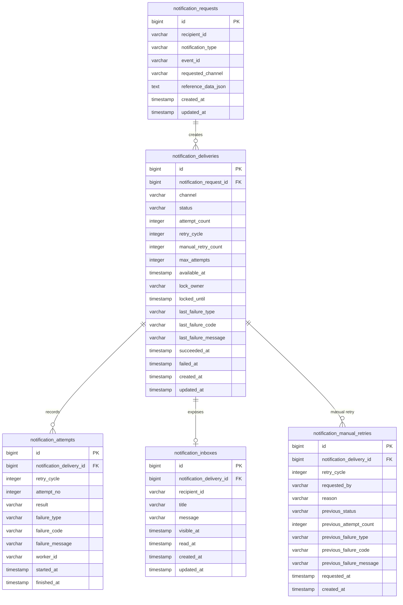

# futureschole
프로덕트 엔지니어 채용 과제

## 프로젝트 개요

수강 신청 완료, 결제 확정, 결제 취소, 강의 시작 D-1, 댓글 답글, 새 기기 로그인 등 다양한 이벤트에 대해 EMAIL 또는 IN_APP 알림 발송 요청을 등록하고, 실제 발송은 API 요청 스레드와 분리된 Worker가 비동기로 처리하는 시스템입니다.

알림 실패가 비즈니스 트랜잭션에 영향을 주지 않도록 요청 등록과 발송 처리를 분리했으며, 재시도, 중복 방지, 서버 재시작 후 재처리, 다중 인스턴스 Worker 중복 처리 방지를 고려했습니다.

실제 이메일 발송은 하지 않고 `EmailDispatcher`에서 `[MOCK EMAIL SENT]` 로그 출력으로 대체합니다.

## 기술 스택

- Java 17
- Spring Boot 3.5.14
- Spring Web
- Spring Data JPA
- PostgreSQL
- Flyway
- springdoc-openapi Swagger UI
- JUnit 5 / MockMvc / H2 Test DB
- Docker / Docker Compose

## 실행 방법

Docker로 애플리케이션과 PostgreSQL을 함께 실행합니다.

```bash
docker compose up --build
```

실행 후 접근 주소는 다음과 같습니다.

- API 서버: `http://localhost:8080`
- Swagger UI: `http://localhost:8080/swagger-ui.html`
- OpenAPI JSON: `http://localhost:8080/v3/api-docs`

## 요구사항 해석 및 가정

### 알림 발송 요청의 의미

`POST /notifications`의 "접수 완료" 응답은 실제 발송 완료가 아니라 비동기 처리 대기 상태를 의미합니다. API는 알림 요청과 발송 작업을 DB에 저장한 뒤 즉시 응답하고, 실제 발송은 Worker가 처리합니다.

### 중복 기준

동일 이벤트 중복 발송 방지는 다음 3개 값으로 판단합니다.

```text
recipientId + notificationType + eventId
```

여기서 `+`는 세 값을 문자열로 이어 붙인다는 뜻이 아니라, DB에서 세 컬럼을 하나의 복합 unique key로 묶어 판단한다는 뜻입니다.

| 값 | 의미 | 예시 |
|---|---|---|
| `recipientId` | 알림을 받을 사용자 ID | `user-1001` |
| `notificationType` | 어떤 종류의 알림인지 나타내는 타입 | `PAYMENT_CONFIRMED` |
| `eventId` | 알림을 발생시킨 원천 이벤트 ID | `payment-20260522-0001` |

예를 들어 `user-1001`에게 `PAYMENT_CONFIRMED` 타입으로 `payment-20260522-0001` 이벤트 알림을 이미 등록했다면, 같은 세 값으로 다시 요청이 들어와도 새로운 알림 요청을 만들지 않습니다. 이 중복 기준은 `notification_requests(recipient_id, notification_type, event_id)` unique constraint로 최종 보장합니다.

발송 채널은 중복 기준에서 제외했습니다. 현재 MVP에서는 하나의 이벤트 알림 요청이 하나의 채널 정책을 가진다고 해석했기 때문입니다. 같은 중복 기준으로 동일 채널 요청이 다시 들어오면 기존 알림을 `200 OK`로 반환하고, 다른 채널로 들어오면 `409 Conflict`를 반환합니다.

### MVP 이벤트 기본 세트

이 프로젝트에서 말하는 강의는 이미 동영상이 업로드된 온라인 강의로 해석합니다. 

| 이벤트 | 의미 |
|---|---|
| `ENROLLMENT_COMPLETED` | 수강 신청 완료 |
| `PAYMENT_CONFIRMED` | 결제 확정 |
| `PAYMENT_CANCELED` | 결제 취소 처리 완료 |
| `COURSE_STARTING_TOMORROW` | 온라인 강의 수강 시작일 D-1 |
| `COMMENT_REPLIED` | 내 댓글 또는 질문에 답글 등록 |
| `LOGIN_FROM_NEW_DEVICE` | 새 기기 로그인 감지 |

### 간략 인증/인가

과제 조건에 따라 실제 인증/인가는 구현하지 않고, 사용자 API에서는 `X-User-Id`, 운영자 수동 재시도 API에서는 `X-Admin-Id` 헤더를 사용합니다. 실제 서비스에서는 Spring Security 인증 컨텍스트에서 현재 사용자 정보를 가져오는 방식으로 대체할 수 있습니다.

### 알림 상태 조회 API의 접근 주체

`GET /notifications/{notificationId}`는 일반 사용자가 알림함에서 사용하는 API가 아니라, 내부 시스템 또는 운영자가 특정 알림 요청의 처리 상태를 확인하는 API로 해석했습니다.

이 API는 다음 상황에서 사용하도록 설계했습니다.

- 알림 요청이 정상 접수되었는지 확인할 때
- 특정 알림이 아직 `PENDING`인지, Worker가 처리 중인 `PROCESSING`인지 확인할 때
- 일시 실패로 `RETRY_WAITING` 상태가 되었고 다음 재시도 가능 시각이 언제인지 확인할 때
- 최종 실패(`FAILED`)한 알림의 실패 코드와 실패 메시지를 확인한 뒤 운영자가 수동 조치 또는 수동 재시도 여부를 판단할 때
- 내부 시스템이 알림 요청 ID를 알고 있고, 해당 요청의 현재 발송 결과를 추적해야 할 때

사용자에게 노출되는 인앱 알림 목록은 별도의 `GET /me/notifications` API로 분리했습니다. 따라서 `GET /notifications/{notificationId}`는 사용자 알림함 조회나 읽음 처리 용도가 아니라 운영 상태 확인 용도입니다. 실제 운영 환경에서는 이 API 앞에 관리자 인증/인가가 필요하지만, 과제에서는 간략 인증 허용 조건에 따라 별도 권한 검증은 제약사항으로 남겼습니다.

### 사용자 알림 목록 조회 API의 의미

`GET /me/notifications`는 사용자가 자신의 인앱 알림함을 여는 API로 해석했습니다. 별도 알림 페이지가 없더라도, 사용자가 상단 알림 버튼이나 알림 드롭다운을 눌렀을 때 현재까지 쌓인 인앱 알림 목록을 조회하는 용도입니다.

알림이 계속 쌓일 수 있으므로 이 API에는 페이징 기능을 포함했습니다. 클라이언트는 `page`, `size`, `readStatus`를 전달해 전체/읽음/안읽음 알림을 나누어 조회할 수 있습니다.

이 API에서 말하는 "알림"은 EMAIL 알림이 아니라 IN_APP 알림만 의미합니다. 이메일 알림은 사용자의 외부 메일함에서 확인하는 채널이며, 서비스 내부 알림함에서 읽음/안읽음 상태를 표시할 대상이 아니라고 판단했습니다. 따라서 사용자 알림 목록 조회와 읽음 처리는 `notification_inboxes`에 저장된 인앱 알림만 대상으로 합니다.

### 개선 의견 및 운영 한계

이 과제는 실제 메시지 브로커와 실제 이메일 발송 없이 알림 처리 구조를 설계하는 범위로 해석했습니다. 현재 구현은 DB에 발송 작업을 저장하고 Worker가 비동기로 처리하므로, API 요청 스레드와 발송 실패를 분리하고 서버 재시작 후에도 미처리 작업을 재처리할 수 있습니다.

다만 실제 운영 환경에서는 다음 보완이 필요합니다.

| 항목 | 현재 구현 | 운영 환경 개선 의견 |
|---|---|---|
| 외부 발송의 정확한 중복 방지 | DB unique constraint와 Worker claim으로 DB 내부 중복 생성/중복 처리를 방지 | 실제 SMTP/외부 provider 호출은 외부 side effect이므로, 발송 성공 직후 DB 반영 전에 서버가 종료되면 재처리 시 중복 발송 가능성이 남습니다. 운영에서는 provider idempotency key, transactional outbox, 외부 발송 이력 대조 같은 보완이 필요합니다. |
| 메시지 브로커 | DB polling Worker로 구현 | 트래픽이 커지면 Kafka/RabbitMQ 같은 브로커로 Worker trigger를 전환하고, DB는 최종 상태 저장소와 감사 이력 저장소로 유지하는 방식이 적합합니다. |
| 재시도 설정 | 과제 검증이 쉽도록 2초부터 시작하는 짧은 지수 백오프 사용 | 운영에서는 이메일 provider의 rate limit, 장애 지속 시간, 사용자 지연 허용치, 재시도 성공률 지표를 보고 값을 조정해야 합니다. |
| 사용자 알림 목록 페이징 | offset paging 사용 | 알림이 매우 많아지면 뒤 페이지 조회 성능이 떨어질 수 있으므로 `visibleAt + inboxId` 기반 cursor paging으로 전환하는 것이 좋습니다. |
| 관측 가능성 | 테스트와 상태 조회 API 중심 | 운영에서는 Worker 처리량, 실패율, 재시도 누적 수, `PROCESSING` 장기 점유 건수, `FAILED` 증가량에 대한 metric과 alert가 필요합니다. |

정리하면, 현재 구현은 과제의 필수 요구사항을 검증 가능한 수준으로 만족하는 MVP입니다. 운영 수준으로 확장할 때는 외부 발송 side effect의 idempotency, 권한 검증, 관측 가능성, 대용량 조회 성능을 우선적으로 보완해야 합니다.

## 비동기 처리 구조 및 재시도 정책 설명 문서

### API 요청과 실제 발송 분리

알림 발송 요청 API는 외부 이메일 서버나 인앱 알림 처리 실패에 직접 영향받지 않아야 합니다. 따라서 API 요청 스레드에서는 `notification_requests`와 `notification_deliveries`만 저장하고 즉시 반환합니다. 실제 발송은 DB에 저장된 `PENDING` 발송 작업을 Worker가 비동기로 처리합니다.

처리 흐름은 다음과 같습니다.

```text
POST /notifications
-> notification_requests 저장
-> notification_deliveries 저장
-> API는 202 Accepted 또는 200 OK 반환
-> NotificationDispatchWorker가 처리 대상 delivery 조회
-> 원자적 claim 성공 시 PROCESSING 전환
-> ChannelDispatcher가 EMAIL 또는 IN_APP 발송 수행
-> 성공 시 SUCCEEDED, 실패 시 RETRY_WAITING 또는 FAILED 전환
```

### DB Polling Worker 채택

과제 제약상 실제 메시지 브로커 설치가 불필요하므로 DB Polling Worker를 사용했습니다. 발송 작업은 DB에 영속화되므로 서버가 재시작되어도 유실되지 않고, 추후 Kafka/RabbitMQ로 전환할 때는 Worker 트리거 영역과 dispatcher 연결부를 교체하는 방식으로 확장할 수 있습니다.

Worker는 `PENDING`, `RETRY_WAITING` 상태이면서 `availableAt <= now`인 발송 작업만 가져옵니다. 이후 DB update 결과가 1건일 때만 claim에 성공한 것으로 보고 처리합니다. 이 구조는 여러 인스턴스의 Worker가 동시에 같은 delivery를 잡으려 해도 하나의 Worker만 `PROCESSING`으로 전환할 수 있게 합니다.

### `@Async`를 사용하지 않은 이유

Spring의 `@Async`는 메서드를 별도 스레드에서 실행하게 해주는 기능입니다. 하지만 이 과제의 핵심은 단순히 요청 스레드와 발송 스레드를 분리하는 것이 아니라, 서버 재시작 후 미처리 작업 재처리, 재시도, 실패 사유 기록, 다중 인스턴스 중복 처리 방지까지 포함합니다.

`@Async`만으로 발송을 처리하면 작업 상태가 애플리케이션 스레드 풀 안에 머무르기 쉽고, 별도 영속 작업 저장소가 없다면 서버 재시작 시 처리 중이던 작업을 추적하기 어렵습니다. 물론 API 요청 시점에 DB에 작업을 먼저 저장하고 `@Async`를 단순 트리거로만 사용하는 방식은 가능합니다. 하지만 이 경우에도 재시도 대상 조회, 오래 걸린 `PROCESSING` 복구, 다중 인스턴스 claim 제어는 결국 DB나 별도 브로커가 담당해야 합니다.

따라서 이 프로젝트는 `@Async` 대신 DB에 영속화된 `notification_deliveries`를 Worker가 polling하는 구조를 선택했습니다. 이 방식은 즉시성은 `@Async`보다 약할 수 있지만, 과제에서 요구한 운영 시나리오를 코드와 DB 상태로 검증하기 쉽습니다.

### 발송 상태 모델

발송 작업 상태는 `notification_deliveries` 기준으로 관리합니다.

| 상태 | 의미 |
|---|---|
| `PENDING` | 등록 완료, Worker 처리 대기 |
| `PROCESSING` | Worker가 점유하여 처리 중 |
| `RETRY_WAITING` | 일시 실패 후 다음 재시도 시각까지 대기 |
| `SUCCEEDED` | 발송 성공 |
| `FAILED` | 최대 재시도 초과 또는 영구 실패 |

요청 자체에는 별도 상태 컬럼을 두지 않고, 응답 시 delivery 상태를 집계합니다. 모든 delivery가 성공하면 `SUCCEEDED`, 하나라도 실패하면 `FAILED`, 처리 중인 delivery가 있으면 `PROCESSING`, 재시도 대기 중이면 `RETRY_WAITING`, 그 외에는 `PENDING`으로 응답합니다.

### 상태 전이 조건

상태 전이는 `notification_deliveries`의 발송 작업 단위로 일어납니다. API 요청 자체는 발송을 직접 수행하지 않고, Worker와 복구 Worker가 아래 조건에 따라 상태를 변경합니다.

| From | To | 전이 조건 | 함께 변경되는 값 |
|---|---|---|---|
| 없음 | `PENDING` | `POST /notifications` 요청이 중복 검사를 통과해 새 delivery가 생성됨 | `attemptCount=0`, `retryCycle=0`, `availableAt=now` |
| `PENDING` | `PROCESSING` | Worker가 처리 가능 시각이 된 delivery를 원자적으로 claim하는 데 성공 | `attemptCount++`, `lockOwner`, `lockedUntil` 기록, `notification_attempts` 시작 이력 생성 |
| `RETRY_WAITING` | `PROCESSING` | 재시도 가능 시각(`availableAt`)이 지난 delivery를 Worker가 원자적으로 claim하는 데 성공 | `attemptCount++`, `lockOwner`, `lockedUntil` 기록, 새 `notification_attempts` 시작 이력 생성 |
| `PROCESSING` | `SUCCEEDED` | `ChannelDispatcher`가 성공 결과를 반환 | `succeededAt` 기록, lock 해제, 마지막 실패 정보 제거 |
| `PROCESSING` | `RETRY_WAITING` | 일시 실패가 발생했고 아직 최대 시도 횟수에 도달하지 않음 | `lastFailureType`, `lastFailureCode`, `lastFailureMessage` 기록, 다음 `availableAt` 계산, lock 해제 |
| `PROCESSING` | `FAILED` | 영구 실패가 발생하거나 일시 실패가 최대 시도 횟수에 도달함 | `failedAt`, `lastFailureType`, `lastFailureCode`, `lastFailureMessage` 기록, lock 해제 |
| `PROCESSING` | `PENDING` | 서버 종료 등으로 Worker가 결과를 기록하지 못했고 `lockedUntil`이 지남 | 복구 Worker가 lock을 해제하고 다시 처리 대기 상태로 전환 |
| `FAILED` | `PENDING` | 운영자가 수동 재시도 API를 호출 | `retryCycle++`, `manualRetryCount++`, `attemptCount=0`, `availableAt=now` |

`PROCESSING` 전환은 단순 조회 후 변경이 아니라 DB update 결과가 1건일 때만 성공으로 판단합니다. 이 때문에 다중 인스턴스 환경에서 여러 Worker가 같은 delivery를 동시에 처리하려고 해도 하나의 Worker만 상태 전이에 성공합니다.

### 자동 재시도 정책

일시 실패는 `RETRY_WAITING`으로 전환하고, 다음 처리 가능 시각 이후 Worker가 다시 처리합니다. 현재 정책은 지수 백오프를 사용합니다.

```yaml
notification:
  retry:
    max-attempts: 5
    initial-delay: 2s
    multiplier: 2
    max-delay: 32s
```

재시도 대기 시간은 현재 재시도 사이클의 `attemptCount`를 기준으로 계산합니다. 이때 `max-attempts`는 "재시도만의 횟수"가 아니라 최초 발송을 포함한 전체 발송 시도 횟수입니다.

| 실패한 attemptCount | 다음 상태 | 다음 처리 대기 시간 |
|---:|---|---:|
| 1 | `RETRY_WAITING` | 2초 |
| 2 | `RETRY_WAITING` | 4초 |
| 3 | `RETRY_WAITING` | 8초 |
| 4 | `RETRY_WAITING` | 16초 |
| 5 | `FAILED` | 재시도 없음 |

이 값은 과제 테스트와 로컬 검증에서 재시도 흐름을 빠르게 확인할 수 있도록 비교적 짧게 설정했습니다. 초기 지연을 2초로 두면 일시 장애를 즉시 재시도하지 않아 순간적인 실패를 한 번 흡수할 수 있고, 전체 재시도 흐름도 오래 기다리지 않고 확인할 수 있습니다. 배수를 2로 둔 이유는 대기 시간이 급격히 커지는 것을 막으면서도 실패가 반복될수록 호출 빈도를 줄이기 위해서입니다. 최대 지연 32초는 `max-attempts`를 늘릴 경우 대기 시간이 무한히 커지지 않도록 막는 상한입니다. 현재 `max-attempts: 5` 설정에서는 5번째 실패 시 최종 실패가 되므로 실제 자동 재시도 대기 시간은 최대 16초까지 발생합니다.

반대로 이 설정은 실제 대규모 운영 환경의 정답값이라고 고정할 수는 없습니다. 실제 SMTP 서버, 푸시 서버, 사내 알림 게이트웨이의 rate limit 정책과 장애 지속 시간은 서비스마다 다르므로 운영 환경에서는 외부 provider 정책, 실패 로그, 재시도 성공률, 사용자 지연 허용치를 기준으로 값을 다시 조정해야 합니다.

영구 실패 또는 최대 시도 횟수 초과 시 `FAILED`가 됩니다.

### 실패 사유 기록 방식

실패는 단순히 예외를 무시하지 않고, "현재 상태 확인용 정보"와 "과거 시도 이력"에 나누어 기록합니다.

| 저장 위치 | 기록 내용 | 목적 |
|---|---|---|
| `notification_deliveries.last_failure_type` | `RETRYABLE` 또는 `PERMANENT` | 현재 delivery의 마지막 실패가 일시 실패인지 영구 실패인지 확인 |
| `notification_deliveries.last_failure_code` | `SMTP_TIMEOUT`, `INVALID_EMAIL`, `DISPATCH_EXCEPTION` 같은 실패 코드 | 운영자가 실패 원인을 빠르게 분류 |
| `notification_deliveries.last_failure_message` | 외부 채널 또는 dispatcher가 반환한 실패 메시지 | 운영자 확인용 상세 사유 보관 |
| `notification_attempts.failure_type` | 해당 시도에서 발생한 실패 유형 | 각 시도별 실패 유형 추적 |
| `notification_attempts.failure_code` | 해당 시도에서 발생한 실패 코드 | 재시도마다 실패 원인이 바뀌었는지 확인 |
| `notification_attempts.failure_message` | 해당 시도에서 발생한 실패 메시지 | 과거 실패 이력 보존 |

`notification_deliveries`에는 마지막 실패 정보만 남기므로 상태 조회 API가 현재 문제를 빠르게 보여줄 수 있습니다. 반면 `notification_attempts`에는 매 시도마다 결과와 실패 사유를 남기므로, 자동 재시도 과정에서 어떤 실패가 반복되었는지 추적할 수 있습니다. 수동 재시도 후에도 과거 attempt 이력은 삭제하지 않고 `retryCycle`로 구분합니다.

### PROCESSING 장기 점유 복구

Worker가 delivery를 `PROCESSING`으로 claim한 뒤 서버가 종료되거나 예외 상황으로 결과를 기록하지 못하면 작업이 오래 멈춘 것처럼 보일 수 있습니다. 이를 복구하기 위해 claim 시 `lockUntil`을 함께 저장합니다.

`NotificationRecoveryWorker`는 `PROCESSING` 상태이면서 `lockUntil < now`인 delivery를 다시 `PENDING`으로 되돌립니다. 이때 `attemptCount`는 줄이지 않습니다. 외부 채널 호출이 실제로 도달했는지 서버가 확신할 수 없기 때문에, 이미 시도한 것으로 보수적으로 계산하는 편이 무한 재시도 위험을 줄일 수 있다고 판단했습니다.

### 실제 운영 환경 전환 가능성

현재 구현은 메시지 브로커 없이 DB를 작업 큐처럼 사용하지만, 운영 환경으로 전환할 때 교체해야 할 부분과 유지할 부분을 분리해두었습니다.

| 구조 | 현재 구현 | 운영 전환 시 |
|---|---|---|
| 작업 저장소 | `notification_deliveries`에 발송 작업과 상태를 영속화 | 브로커 도입 후에도 최종 상태와 감사 이력 저장소로 유지 |
| Worker trigger | `@Scheduled` 기반 DB polling | Kafka/RabbitMQ consumer 또는 별도 queue consumer로 교체 가능 |
| 중복 처리 방지 | DB unique constraint와 원자적 claim update | 브로커 consumer가 늘어나도 DB claim 또는 idempotency key로 최종 방어 가능 |
| 채널 발송 | `ChannelDispatcher` 인터페이스와 EMAIL/IN_APP 구현체 | 실제 SMTP, push, webhook adapter로 구현체 교체 가능 |
| 메시지 생성 | `MessageRenderer` 인터페이스와 기본 renderer | DB/관리자 화면 기반 템플릿 renderer로 교체 가능 |
| 설정 | `NotificationProperties`로 worker/retry 설정 외부화 | 환경별 batch size, lock duration, retry backoff 조정 가능 |
| 스키마 관리 | Flyway migration | 운영 배포에서도 DB 변경 이력을 순서대로 관리 가능 |

즉, 현재 구조에서 가장 먼저 교체될 가능성이 큰 부분은 "작업을 깨우는 방식"입니다. DB polling을 브로커 소비 방식으로 바꾸더라도 delivery 상태, attempts 이력, 실패 사유 기록, 사용자 inbox 저장 구조는 유지할 수 있게 설계했습니다.

## 설계 결정과 이유

### Java 17 선택 이유

과제 조건은 Spring Boot 기반 구현이며 Java 또는 Kotlin 선택이 가능했습니다. 이 프로젝트는 Java 17을 선택했습니다.

Java 17은 Spring Boot 3.x 계열의 최소 기준 버전이며, 현재 프로젝트에서 사용하는 `record` DTO, switch expression, 최신 Collection API 사용에 충분합니다. 즉, 이 프로젝트의 코드가 필요로 하는 언어 기능은 Java 17 안에서 이미 안정적으로 충족됩니다.

Java 11은 Spring Boot 3.x의 Java 기준을 만족하지 못하고, Jakarta EE 기반의 현재 코드 방향과도 맞지 않아 제외했습니다. Java 21은 virtual threads, pattern matching 등 더 많은 기능을 제공하지만, 현재 알림 시스템은 `@Scheduled` Worker와 JPA/JDBC 기반 DB polling 구조입니다. virtual threads를 도입하려면 DB connection pool, 트랜잭션 경계, blocking I/O 처리량을 함께 재검토해야 하며, 단순히 Java 버전만 올린다고 이 과제의 핵심 요구사항인 중복 방지, 재시도, 장애 복구 품질이 개선되지는 않습니다.

따라서 Java 17은 Spring Boot 3.x를 사용할 수 있는 기준선을 만족하면서도, 현재 구현에 필요한 언어 기능과 운영 복잡도 사이의 균형이 가장 적절하다고 판단했습니다.

### Spring Boot 3.5.14 선택 이유

Spring Boot `3.5.14`는 현재 프로젝트의 Gradle 설정에 명시적으로 고정된 버전입니다.

Spring Boot 3.x는 Java 17과 Jakarta EE 기반 패키지 체계를 전제로 합니다. 현재 프로젝트의 JPA Entity, Validation, Web MVC 코드는 `jakarta.*` API를 사용하므로 Spring Boot 2.x보다 3.x 계열이 자연스럽습니다.

반대로 Spring Boot 4.x는 최신 stable 계열이지만 Spring Framework 7, Servlet 6.1, Tomcat 11 세대로 넘어가는 major upgrade입니다. major release는 minor/patch release보다 호환성 검토 범위가 커지고, 현재 사용하는 springdoc-openapi, JPA, 테스트 구성 등 주변 라이브러리와의 조합도 다시 검증해야 합니다. 이 과제는 알림 발송 시스템의 비동기 처리, 재시도, 중복 방지, 운영 복구 설계를 평가하는 과제이므로, major upgrade로 얻는 이익이 제한적입니다.

Spring Boot 3.5.14는 3.x 계열의 최신 stable patch 중 하나이며, patch release는 같은 minor 버전 안에서 호환성을 유지하는 방향으로 제공됩니다. 따라서 Spring Boot 3.5.14는 Jakarta 기반의 현재 코드와 맞고, 불필요한 major upgrade 리스크를 피하면서도 3.x 계열의 최신 보완을 반영할 수 있는 선택입니다.

### 패키지 구조 설계 이유

이 프로젝트는 알림 시스템 하나를 중심으로 한 과제이므로, 먼저 도메인 단위로 `notification` 패키지를 두고 그 안에서 책임별 하위 패키지를 나누었습니다. 예외 처리, OpenAPI, Clock처럼 특정 도메인에만 속하지 않는 공통 기능은 `global` 아래에 두었습니다.

```text
com.back
├── global
│   ├── config
│   └── exception
└── notification
    ├── config
    ├── domain
    ├── enums
    ├── infrastructure
    │   ├── dispatcher
    │   ├── persistence
    │   └── renderer
    ├── service
    ├── web
    │   └── dto
    └── worker
```

선택지는 크게 두 가지였습니다.

| 방식 | 장점 | 단점 |
|---|---|---|
| 기술 계층 우선 구조 (`controller`, `service`, `repository`를 최상위에 배치) | 처음 보기 쉽고 작은 CRUD 예제에서는 단순함 | 도메인이 늘어나면 서로 다른 도메인의 controller/service/repository가 한 패키지에 섞여 기능 단위 응집도가 떨어짐 |
| 도메인 우선 구조 (`notification` 아래에 책임별 패키지 배치) | 알림 기능과 관련된 코드를 한 경계 안에서 찾기 쉽고, 이후 `payment`, `course`, `user`가 추가되어도 도메인별 변경 범위가 분리됨 | 한 도메인 안에서도 하위 패키지가 많아져 처음에는 구조가 더 커 보일 수 있음 |

현재 과제는 알림이라는 하나의 도메인 안에 API, Worker, 재시도 정책, dispatcher, renderer, repository가 함께 움직입니다. 그래서 최상위에 `controller`, `service`, `repository`를 두기보다 `notification`이라는 기능 경계를 먼저 만들고, 그 내부에서 역할을 나누는 편이 요구사항 추적에 유리하다고 판단했습니다.

하위 패키지의 책임은 다음과 같습니다.

| 패키지 | 책임 |
|---|---|
| `notification.web` | HTTP API 진입점과 Swagger spec |
| `notification.web.dto` | API 요청/응답 모델 |
| `notification.service` | 알림 요청 등록, 상태 조회, Worker 처리, 복구, 읽음 처리, 수동 재시도 같은 유스케이스 |
| `notification.domain` | Entity와 도메인 정책 객체 |
| `notification.enums` | 상태, 채널, 타입 등 도메인 enum |
| `notification.infrastructure.persistence` | Spring Data JPA repository와 원자적 claim 구현 |
| `notification.infrastructure.dispatcher` | EMAIL, IN_APP 발송 adapter |
| `notification.infrastructure.renderer` | 알림 타입별 메시지 렌더링 구현 |
| `notification.worker` | `@Scheduled` 기반 Worker trigger |
| `notification.config` | 알림 기능 설정과 RetryPolicy bean 구성 |
| `global.config` | Clock, OpenAPI 등 전역 설정 |
| `global.exception` | 공통 예외, 에러 코드, 예외 응답 처리 |

이 구조의 단점은 작은 과제치고 파일과 패키지 수가 많아 보일 수 있다는 점입니다. 하지만 이 과제는 단순 CRUD보다 운영 시나리오가 중요하고, API 요청 처리와 실제 발송 Worker, 외부 채널 adapter, 재시도/복구 정책이 서로 다른 변경 이유를 가집니다. 따라서 파일 수를 줄이기 위해 한 service에 모두 합치기보다, 변경 이유가 다른 책임을 분리하는 쪽을 선택했습니다.

### 사용자 알림함 테이블을 별도로 둔 이유

사용자에게 노출되는 인앱 알림은 `notification_deliveries`를 직접 조회하지 않고 `notification_inboxes` 테이블에 별도로 저장합니다.

`notification_deliveries`는 EMAIL과 IN_APP을 포함한 채널별 발송 작업의 상태를 추적하는 테이블입니다. 반면 `notification_inboxes`는 사용자가 실제로 보는 인앱 알림함 데이터이며, 제목, 메시지, 노출 시각, 읽음 시각을 관리합니다.

두 개념을 하나의 테이블에 합치면 EMAIL 발송 작업에도 읽음 처리 컬럼이 붙게 되고, 발송 상태와 사용자 화면 상태가 섞입니다. 특히 읽음 처리는 IN_APP 알림에만 존재하는 개념이므로, 사용자 알림함 전용 테이블을 따로 두는 편이 도메인 의미가 명확합니다.

이 선택의 단점은 테이블과 Entity가 하나 늘어난다는 점입니다. 하지만 알림 발송 상태 관리와 사용자 알림함 관리는 변경 이유가 다르므로, 장기적으로는 분리하는 편이 더 안전하다고 판단했습니다.

### PostgreSQL 선택 이유

과제에서 H2, MySQL, PostgreSQL 중 선택이 가능했으며, 이 프로젝트는 PostgreSQL을 선택했습니다.

Docker Compose로 애플리케이션을 실행하면 PostgreSQL 컨테이너가 함께 실행되고, 애플리케이션은 `application-docker.yml`의 PostgreSQL 연결 정보를 사용합니다. 즉 제출물을 실행해 기능을 확인하는 환경은 PostgreSQL입니다.

H2는 `./gradlew test`로 자동화 테스트를 실행할 때만 사용합니다. 테스트마다 실제 PostgreSQL 컨테이너를 띄우면 실행 시간이 길어지고 개발 피드백이 느려지므로, 단위/통합 테스트에서는 H2의 PostgreSQL compatibility mode를 사용해 빠르게 검증합니다. 다만 H2는 운영 DB와 동시성 제어, locking, constraint 처리 방식이 완전히 같지는 않습니다. 그래서 이 과제의 실제 실행 환경은 PostgreSQL로 두고, H2는 테스트 편의용으로만 분리했습니다.

MySQL도 운영 DB로 사용할 수 있지만, 현재 구현은 DB unique constraint, row update 기반 Worker claim, Flyway migration, timestamp 기반 polling처럼 표준적인 RDB 기능에 기대고 있습니다. 이 요구사항에서는 MySQL만의 특수 기능이 필요하지 않았고, PostgreSQL은 Docker Compose로 실행 환경을 고정하기 쉽고 constraint/transaction/locking 동작을 명확히 확인하기 좋아 채택했습니다.

정리하면, PostgreSQL 선택의 핵심 이유는 다음입니다.

- DB unique constraint로 중복 요청을 최종 방어해야 함
- Worker claim과 복구 로직이 DB transaction과 row update 결과에 의존함
- Docker Compose로 채점자가 운영 유사 환경을 재현하기 쉬움
- H2는 빠른 자동화 테스트용으로만 사용하고, Docker 실행 환경은 PostgreSQL로 분리하는 편이 과제의 운영 고려 요구에 더 맞음

### DB unique constraint로 중복 최종 보장

애플리케이션 레벨에서 먼저 기존 요청을 조회하더라도, 동시에 같은 요청이 여러 번 들어오면 여러 요청이 모두 "기존 요청 없음"으로 판단할 수 있습니다. 그래서 최종 중복 방지는 DB의 `unique (recipient_id, notification_type, event_id)` 제약으로 보장합니다.

### ID를 UUID가 아니라 auto increment로 사용한 이유

이 프로젝트의 주요 테이블 ID는 UUID가 아니라 DB auto increment 값을 사용합니다. 

UUID를 사용하면 외부에 노출되는 식별자 추측이 어려워지고, 여러 DB나 여러 서비스에서 ID를 독립적으로 생성하기 쉽다는 장점이 있습니다. 반면 값이 길고 사람이 읽기 어려우며, 인덱스 크기와 API 예시 가독성 측면에서는 auto increment보다 부담이 있습니다.

auto increment는 값이 짧고 DB가 생성 책임을 단순하게 맡을 수 있습니다. 또한 과제의 핵심은 ID 생성 전략 자체보다 중복 요청 방지, 비동기 처리, 재시도, 다중 Worker 중복 처리 방지이므로, 내부 PK는 단순한 auto increment를 선택했습니다.

### auto increment ID 노출에 대한 보안 가정과 대응

auto increment ID는 순차적으로 증가하므로 외부 사용자가 ID를 추측하기 쉽다는 단점이 있습니다. 따라서 사용자에게 노출되는 API에서는 "ID를 알면 접근 가능하다"는 방식으로 설계하면 안 됩니다.

이 프로젝트는 과제 조건에 따라 인증/인가는 간략히 처리하며, 사용자 API에서는 `X-User-Id` 헤더를 현재 사용자 식별자로 가정합니다. 다만 실제 운영 상황에서는 클라이언트가 보낸 사용자 ID 헤더를 그대로 신뢰하지 않고, Spring Security 같은 인증/인가 계층을 거친 뒤 서버의 인증 컨텍스트에서 현재 사용자 ID를 꺼내 사용해야 합니다. 이 과제의 `X-User-Id`는 그 인증 컨텍스트를 간략히 대체한 입력값입니다.

이 가정하에서도 사용자 인앱 알림 조회와 읽음 처리는 항상 현재 사용자 조건을 함께 사용합니다.

예를 들어 읽음 처리 API는 요청으로 받은 `inboxId`만으로 update하지 않고, 다음 조건을 함께 만족하는 row만 변경합니다.

```text
id in (요청한 inboxIds)
recipient_id = X-User-Id
read_at is null
visible_at <= 현재 시각
```

따라서 다른 사용자의 `inboxId`를 추측해 요청하더라도 `recipient_id = X-User-Id` 조건을 통과하지 못하므로 실제 변경은 일어나지 않습니다.

반면 알림 상태 조회 API인 `GET /notifications/{notificationId}`는 사용자 화면용 API가 아니라 내부 시스템/운영자 상태 확인 API로 해석했습니다. 이 API에서는 auto increment ID를 사용하되, 실제 운영 환경에서는 관리자 인증/인가를 반드시 붙여야 합니다. 현재 과제에서는 간략 인증 허용 조건에 따라 별도 관리자 권한 검증은 미구현 제약사항으로 남겼습니다.

정리하면, auto increment를 사용하더라도 사용자 소유 데이터 변경은 `currentUserId` 조건으로 방어하고, 운영자용 ID 조회 API는 "관리자 권한 뒤에서 호출된다"는 가정으로 설계했습니다. 실제 서비스에서는 `currentUserId`를 헤더에서 직접 받지 않고 인증 컨텍스트에서 가져와야 하며, 사용자에게 직접 공개되는 식별자가 더 필요하다면 내부 PK와 별도로 public UUID 또는 opaque key를 추가하는 방식이 더 안전합니다.

### `TransactionTemplate` 사용 위치와 이유

이 프로젝트가 모든 트랜잭션에 `TransactionTemplate`을 사용하는 것은 아닙니다. 단순 조회나 일반적인 상태 변경은 `@Transactional`을 사용하고, 트랜잭션 경계를 코드 안에서 명시적으로 나누어야 하는 곳에만 `TransactionTemplate`을 사용했습니다.

사용 위치는 두 곳입니다.

| 위치 | 사용 이유 |
|---|---|
| 알림 요청 등록 | 동시 중복 요청에서 unique constraint 위반이 발생했을 때, 실패한 insert 트랜잭션을 닫고 새 트랜잭션에서 기존 요청을 다시 조회하기 위함 |
| Worker 발송 처리 | delivery claim 트랜잭션과 발송 결과 기록 트랜잭션을 분리해, claim 실패 시 다른 처리를 하지 않고 종료하고 claim 성공 시에만 결과 기록으로 넘어가기 위함 |

특히 알림 요청 등록에서의 `TransactionTemplate` 사용은 동시성 요구사항과 직접 관련이 있습니다. 핵심 이유는 동시 중복 요청에서 unique constraint 위반이 발생했을 때, 실패한 트랜잭션을 명확히 rollback하고 새 트랜잭션에서 기존 알림 요청을 다시 조회해야 하기 때문입니다.

예를 들어 같은 알림 요청 A, B가 동시에 들어오면 둘 다 최초 조회 시점에는 기존 요청이 없다고 판단할 수 있습니다. A가 먼저 insert에 성공하고 B가 insert를 시도하면 DB unique constraint 위반이 발생합니다. 이때 B는 실패한 insert 트랜잭션을 닫은 뒤, 새 트랜잭션에서 A가 만든 기존 요청을 다시 조회해야 합니다.

`@Transactional`을 메서드 전체에 적용하면 insert 실패 이후 같은 트랜잭션 안에서 복구 조회를 시도하게 될 수 있고, 트랜잭션이 rollback-only 상태가 되어 정상 응답을 만들었더라도 종료 시점에 rollback 문제가 발생할 수 있습니다. `TransactionTemplate`은 신규 생성 시도 트랜잭션과 중복 복구 조회 트랜잭션을 코드상에서 분리할 수 있어 이 요구사항에 더 적합합니다.

현재 흐름은 다음과 같습니다.

```text
1. 기존 요청 조회
2. 없으면 새 트랜잭션에서 notification_requests, notification_deliveries 저장
3. unique constraint 위반 발생 시 해당 트랜잭션 rollback
4. 새 트랜잭션에서 기존 요청 재조회
5. 같은 채널이면 200 OK, 다른 채널이면 409 Conflict
```

따라서 이 설명의 의의는 "`TransactionTemplate`을 사용했다" 자체가 아니라, 실패한 트랜잭션 안에서 억지로 복구하지 않고 "생성 시도"와 "중복 복구 조회"를 분리했다는 점에 있습니다. 이 분리가 없으면 동시 중복 요청을 정상적인 `200 OK` 또는 `409 Conflict`로 복구하지 못하고 `500`이나 rollback-only 문제로 번질 수 있습니다.

### 수동 재시도 정책

최종 실패한 알림은 운영자가 수동 재시도할 수 있습니다. 기존 `notification_attempts` 이력은 보존하고, delivery의 `attemptCount`는 0으로 초기화합니다. 대신 `retryCycle`을 증가시켜 새 사이클의 `attemptNo=1`부터 다시 기록하며, 수동 재시도 요청 자체는 `notification_manual_retries`에 별도로 보관합니다.

예를 들어 EMAIL 발송 작업이 자동 재시도 5회를 모두 소진해 최종 실패했다고 가정합니다.

| 시점 | delivery 상태 | retryCycle | attemptCount | attempts 이력 |
|---|---|---:|---:|---|
| 최초 등록 | `PENDING` | 0 | 0 | 없음 |
| 자동 1차 실패 | `RETRY_WAITING` | 0 | 1 | cycle 0 / attemptNo 1 / 실패 |
| 자동 2차 실패 | `RETRY_WAITING` | 0 | 2 | cycle 0 / attemptNo 2 / 실패 |
| 자동 5차 실패 | `FAILED` | 0 | 5 | cycle 0 / attemptNo 5 / 실패 |

이 상태에서 운영자가 수동 재시도를 요청하면 delivery는 다음처럼 바뀝니다.

| 변경 항목 | 값 |
|---|---|
| status | `FAILED` -> `PENDING` |
| retryCycle | `0` -> `1` |
| attemptCount | `5` -> `0` |
| manualRetryCount | `0` -> `1` |
| notification_manual_retries | 수동 재시도 요청자, 사유, 이전 실패 상태 저장 |

이후 Worker가 다시 처리하면 과거 attemptNo와 충돌하지 않고 새 사이클에서 다시 `attemptNo=1`부터 기록됩니다.

| retryCycle | attemptNo | 의미 |
|---:|---:|---|
| 0 | 1 | 최초 자동 발송 1차 시도 |
| 0 | 2 | 최초 자동 발송 2차 시도 |
| 0 | 5 | 최초 자동 발송 5차 시도, 최종 실패 |
| 1 | 1 | 수동 재시도 후 새 1차 시도 |

따라서 `attemptCount`는 현재 재시도 사이클 안에서의 시도 횟수를 의미하고, 전체 과거 이력은 `notification_attempts`의 `retryCycle + attemptNo` 조합으로 추적합니다.

### 사용자 알림 읽음 처리 범위

사용자가 알림 버튼을 눌렀을 때 안읽은 알림이 페이징 크기보다 많을 수 있습니다. 예를 들어 안읽은 알림이 12개이고 첫 페이지 크기가 10개라면, 화면에는 10개만 렌더링되고 나머지 2개는 아직 사용자에게 보이지 않습니다.

이때 선택지는 두 가지였습니다.

| 선택지 | 장점 | 단점 |
|---|---|---|
| 알림함을 열면 모든 안읽은 알림을 읽음 처리 | 구현과 클라이언트 호출이 단순함 | 사용자가 실제로 보지 않은 알림까지 읽음 처리됨 |
| 현재 화면에 렌더링된 알림만 읽음 처리 | 사용자가 본 알림만 읽음 처리되어 의미가 정확함 | 클라이언트가 조회 후 보이는 `inboxId` 목록으로 별도 PATCH 요청을 보내야 함 |

현재 구현은 두 번째 방식을 선택했습니다. `GET /me/notifications`는 조회만 수행하고, 실제 읽음 처리는 `PATCH /me/notifications/read`에서 클라이언트가 전달한 `inboxIds`만 대상으로 수행합니다. 따라서 첫 페이지에 10개만 보였다면 그 10개만 읽음 처리되고, 다음 페이지의 2개는 사용자가 실제로 조회하기 전까지 안읽음 상태로 남습니다.

### 여러 기기 동시 읽음 처리

읽음 상태는 기기별 로컬 상태가 아니라 서버 DB의 `notification_inboxes.read_at`에 저장되는 공통 상태입니다. 따라서 한 기기에서 읽음 처리에 성공하면 다른 기기도 다음 알림 목록 조회 시 같은 `read_at` 값을 보게 됩니다.

동시에 여러 기기에서 같은 `inboxId` 목록으로 읽음 처리 요청을 보내도, 서버는 다음 조건을 만족하는 row만 update합니다.

```text
recipient_id = 현재 사용자
id in (요청한 inboxIds)
read_at is null
visible_at <= 현재 시각
```

이 조건 때문에 첫 번째 요청이 `read_at`을 기록하면, 거의 동시에 도착한 두 번째 요청은 `read_at is null` 조건을 통과하지 못합니다. 결과적으로 두 요청 모두 성공 응답을 받을 수는 있지만, 실제 변경 건수인 `markedCount`는 먼저 처리된 요청에서만 증가합니다. 이 방식은 같은 요청을 여러 번 보내도 최종 상태가 깨지지 않는 멱등한 읽음 처리에 가깝게 동작합니다.

단, 현재 구현은 WebSocket이나 SSE로 다른 기기에 실시간 읽음 상태 변경 이벤트를 push하지는 않습니다. 여러 기기 간 상태는 다음 조회 시점에 DB 기준으로 동기화됩니다.

## 미구현 / 제약사항

### 공통

- 실제 SMTP 연동은 하지 않습니다. EMAIL은 로그 출력 Mock입니다.
- 실제 메시지 브로커는 사용하지 않습니다.
- 인증/인가는 `X-User-Id`, `X-Admin-Id` 헤더 기반의 간략 방식입니다. 실제 Spring Security 인증 컨텍스트와 관리자 권한 검증은 구현하지 않았습니다.

### 알림 발송 요청 등록 API

- 현재 MVP는 하나의 알림 요청이 EMAIL 또는 IN_APP 중 하나의 채널로만 발송됩니다. 다만 `DispatchChannel`이 여러 `DeliveryChannel`을 반환할 수 있는 구조이므로, 추후 `EMAIL_AND_IN_APP` 같은 채널 정책을 추가하면 하나의 요청에서 EMAIL delivery와 IN_APP delivery를 함께 생성하도록 확장할 수 있습니다.

### 알림 상태 조회 API

- `GET /notifications/{notificationId}`는 운영자/내부 시스템용 API로 해석했기 때문에 auto increment 기반 내부 알림 요청 ID를 그대로 사용합니다.

### 사용자 알림 목록 / 읽음 처리 API

- 여러 기기 간 읽음 상태는 DB 기준으로 공유되지만, WebSocket/SSE 기반 실시간 push 동기화는 구현하지 않았습니다.

### 최종 실패 알림 수동 재시도 API

- `POST /notifications/{notificationId}/retry`는 `X-Admin-Id` 헤더로 수동 재시도 요청자를 기록하지만, 실제 관리자 권한 검증은 공통 제약사항에 따라 구현하지 않았습니다.

### 선택 구현

- 예약 발송 API는 아직 구현하지 않았습니다.
- 알림 템플릿 CRUD는 아직 구현하지 않았습니다.

## AI 활용 범위

요구사항 해석, 설계 선택지 비교, README 초안 작성, 테스트 시나리오 점검에 AI를 활용했습니다. 실제 구현 결과는 로컬 테스트와 Swagger 확인을 통해 검증하는 방식으로 진행했습니다.

## API 목록 및 예시

| 기능 | Method | Path | 설명 |
|---|---:|---|---|
| 알림 발송 요청 등록 | POST | `/notifications` | 알림 요청을 접수하고 즉시 반환 |
| 알림 상태 조회 | GET | `/notifications/{notificationId}` | 운영자/내부 시스템이 발송 상태 확인 |
| 최종 실패 알림 수동 재시도 | POST | `/notifications/{notificationId}/retry` | FAILED 발송 작업을 새 재시도 사이클로 전환 |
| 사용자 인앱 알림 목록 조회 | GET | `/me/notifications` | 현재 사용자 기준 인앱 알림 목록 조회 |
| 화면에 렌더링된 알림 읽음 처리 | PATCH | `/me/notifications/read` | 요청한 inboxId 목록만 읽음 처리 |

### 알림 발송 요청 등록

알림 요청을 DB에 등록하고 즉시 응답합니다. 이 API는 실제 발송을 직접 수행하지 않으며, 응답 시점의 delivery 상태는 보통 `PENDING`입니다.

```http
POST /notifications
Content-Type: application/json

{
  "recipientId": "user-1001",
  "notificationType": "PAYMENT_CONFIRMED",
  "eventId": "payment-20260522-0001",
  "channel": "EMAIL",
  "referenceData": {
    "paymentId": "pay-9001",
    "courseId": "course-3001"
  }
}
```

신규 요청이면 `202 Accepted`를 반환합니다.

```json
{
  "notificationId": 1,
  "recipientId": "user-1001",
  "notificationType": "PAYMENT_CONFIRMED",
  "eventId": "payment-20260522-0001",
  "requestedChannel": "EMAIL",
  "status": "PENDING",
  "deliveries": [
    {
      "deliveryId": 1,
      "channel": "EMAIL",
      "status": "PENDING",
      "attemptCount": 0,
      "retryCycle": 0,
      "manualRetryCount": 0,
      "maxAttempts": 5,
      "availableAt": "2026-05-22T19:30:00",
      "lastFailureCode": null,
      "lastFailureMessage": null,
      "succeededAt": null,
      "failedAt": null
    }
  ],
  "duplicated": false,
  "createdAt": "2026-05-22T19:30:00"
}
```

같은 `recipientId + notificationType + eventId`와 같은 채널로 다시 요청하면 새 row를 만들지 않고 기존 알림을 `200 OK`로 반환합니다.

```json
{
  "notificationId": 1,
  "recipientId": "user-1001",
  "notificationType": "PAYMENT_CONFIRMED",
  "eventId": "payment-20260522-0001",
  "requestedChannel": "EMAIL",
  "status": "PENDING",
  "deliveries": [
    {
      "deliveryId": 1,
      "channel": "EMAIL",
      "status": "PENDING",
      "attemptCount": 0,
      "retryCycle": 0,
      "manualRetryCount": 0,
      "maxAttempts": 5,
      "availableAt": "2026-05-22T19:30:00",
      "lastFailureCode": null,
      "lastFailureMessage": null,
      "succeededAt": null,
      "failedAt": null
    }
  ],
  "duplicated": true,
  "createdAt": "2026-05-22T19:30:00"
}
```

같은 중복 기준인데 다른 채널로 요청하면 `409 Conflict`를 반환합니다. 이미 같은 이벤트 알림이 한 채널 정책으로 접수되었으므로, 다른 채널로 별도 발송 작업을 추가하지 않습니다.

```json
{
  "error": {
    "code": "NOTIFICATION_CHANNEL_CONFLICT",
    "status": "409",
    "message": "동일 알림 요청이 다른 채널로 이미 존재합니다."
  }
}
```

### 알림 처리 상태 조회

내부 시스템 또는 운영자가 특정 알림 요청의 현재 상태를 확인합니다. 사용자 알림함 조회가 아니라 운영 상태 확인용 API로 해석했습니다.

```http
GET /notifications/1
```

```json
{
  "notificationId": 1,
  "recipientId": "user-1001",
  "notificationType": "PAYMENT_CONFIRMED",
  "eventId": "payment-20260522-0001",
  "requestedChannel": "EMAIL",
  "referenceData": {
    "paymentId": "pay-9001",
    "courseId": "course-3001"
  },
  "status": "RETRY_WAITING",
  "deliveries": [
    {
      "deliveryId": 1,
      "channel": "EMAIL",
      "status": "RETRY_WAITING",
      "attemptCount": 1,
      "retryCycle": 0,
      "manualRetryCount": 0,
      "maxAttempts": 5,
      "availableAt": "2026-05-22T19:30:02",
      "lastFailureCode": "SMTP_TIMEOUT",
      "lastFailureMessage": "SMTP 서버 응답 지연",
      "succeededAt": null,
      "failedAt": null
    }
  ],
  "createdAt": "2026-05-22T19:30:00",
  "updatedAt": "2026-05-22T19:30:00"
}
```

존재하지 않는 알림 요청 ID를 조회하면 `404 Not Found`를 반환합니다.

```json
{
  "error": {
    "code": "NOTIFICATION_NOT_FOUND",
    "status": "404",
    "message": "알림 요청을 찾을 수 없습니다."
  }
}
```

### 최종 실패 알림 수동 재시도

운영자가 `FAILED` 상태의 발송 작업을 다시 `PENDING` 상태로 되돌립니다. 기존 발송 시도 이력은 삭제하지 않고, 새 `retryCycle`에서 다시 시도합니다.

```http
POST /notifications/1/retry
X-Admin-Id: admin-1
Content-Type: application/json

{
  "reason": "외부 이메일 서버 장애 복구 후 재시도합니다."
}
```

```json
{
  "notificationId": 1,
  "requestedBy": "admin-1",
  "reason": "외부 이메일 서버 장애 복구 후 재시도합니다.",
  "requestedAt": "2026-05-23T11:00:00",
  "retriedDeliveryCount": 1,
  "deliveries": [
    {
      "deliveryId": 1,
      "channel": "EMAIL",
      "status": "PENDING",
      "retryCycle": 1,
      "attemptCount": 0,
      "manualRetryCount": 1
    }
  ]
}
```

수동 재시도 가능한 최종 실패 delivery가 없으면 `409 Conflict`를 반환합니다.

```json
{
  "error": {
    "code": "NOTIFICATION_MANUAL_RETRY_NOT_ALLOWED",
    "status": "409",
    "message": "수동 재시도 가능한 최종 실패 알림이 없습니다."
  }
}
```

### 사용자 인앱 알림 목록 조회

현재 사용자의 인앱 알림함 목록을 조회합니다. 과제 조건에 따라 `X-User-Id` 헤더를 현재 사용자 식별자로 사용합니다.

```http
GET /me/notifications?readStatus=UNREAD&page=0&size=10
X-User-Id: user-1001
```

`notification_inboxes` 기준으로 조회하므로 EMAIL 알림은 사용자 인앱 알림 목록에 포함되지 않습니다.

```json
{
  "recipientId": "user-1001",
  "readStatus": "UNREAD",
  "page": 0,
  "size": 10,
  "totalElements": 1,
  "totalPages": 1,
  "hasNext": false,
  "content": [
    {
      "inboxId": 10,
      "notificationId": 3,
      "deliveryId": 3,
      "notificationType": "COURSE_STARTING_TOMORROW",
      "eventId": "course-start-20260523-1",
      "title": "강의 시작 알림",
      "message": "내일 수강 예정인 강의가 시작됩니다.",
      "referenceData": {
        "courseId": "course-3001"
      },
      "read": false,
      "visibleAt": "2026-05-23T10:20:00",
      "readAt": null,
      "createdAt": "2026-05-23T10:20:00"
    }
  ]
}
```

`readStatus`는 `ALL`, `READ`, `UNREAD`를 지원합니다. `page`는 0부터 시작하고, `size`는 1 이상 50 이하만 허용합니다.

### 현재 화면 알림 읽음 처리

```http
PATCH /me/notifications/read
X-User-Id: user-1001
Content-Type: application/json

{
  "inboxIds": [1, 2, 3]
}
```

전체 안읽음 알림을 일괄 읽음 처리하지 않고, 현재 화면에 렌더링된 알림 ID만 읽음 처리합니다. 다른 사용자의 `inboxId`를 추측해 요청해도 `recipientId = X-User-Id` 조건으로 실제 변경되지 않습니다.

```json
{
  "recipientId": "user-1001",
  "requestedCount": 3,
  "markedCount": 3,
  "readAt": "2026-05-23T10:30:00"
}
```

같은 요청을 여러 기기에서 동시에 보내거나 이미 읽은 알림을 다시 읽음 처리하면, 이미 `readAt`이 기록된 row는 다시 변경하지 않습니다. 이 경우 요청은 성공하지만 `markedCount`가 실제 변경된 개수만큼만 반환됩니다.

## 데이터 모델 설명

주요 테이블은 다음과 같습니다.

| 테이블 | 역할 |
|---|---|
| `notification_requests` | 알림 요청 원본, 중복 방지 기준, 요청 채널 정책, 참조 데이터 보관 |
| `notification_deliveries` | 채널별 실제 발송 작업, 상태, 재시도 횟수, 실패 사유 보관 |
| `notification_attempts` | Worker 발송 시도 이력 보관 |
| `notification_inboxes` | 사용자에게 노출되는 인앱 알림함 데이터 보관 |
| `notification_manual_retries` | 운영자 수동 재시도 요청 이력 보관 |

### ERD



### 테이블 관계

`notification_requests`는 알림 요청 원본입니다. 중복 방지 기준인 `recipient_id`, `notification_type`, `event_id`와 요청 채널 정책, 메시지 생성에 필요한 참조 데이터를 저장합니다.

`notification_deliveries`는 실제 Worker가 처리하는 발송 작업입니다. 현재 MVP에서는 하나의 요청이 하나의 delivery를 만들지만, `requested_channel`이 여러 실제 채널을 포함하도록 확장되면 하나의 request가 EMAIL delivery와 IN_APP delivery를 함께 가질 수 있습니다. 그래서 발송 상태, 재시도 횟수, lock, 실패 사유는 request가 아니라 delivery에 둡니다.

`notification_attempts`는 Worker가 delivery를 처리하려고 시도한 이력입니다. delivery에는 마지막 실패 정보만 남고, attempts에는 각 시도별 성공/실패 결과와 실패 사유가 누적됩니다.

`notification_inboxes`는 사용자에게 실제로 보이는 인앱 알림함입니다. EMAIL은 외부 메일함에서 확인하는 채널이므로 이 테이블에 저장하지 않습니다. 읽음/안읽음 상태는 `read_at`으로 표현합니다.

`notification_manual_retries`는 운영자가 최종 실패 알림을 수동 재시도한 이력입니다. 수동 재시도 시 delivery의 `attempt_count`는 0으로 초기화되지만, 이전 실패 상태와 실패 사유는 이 테이블과 `notification_attempts`에 남습니다.

### 주요 제약 조건

| 제약 | 대상 | 목적 |
|---|---|---|
| `uk_notification_request_dedup` | `notification_requests(recipient_id, notification_type, event_id)` | 동일 이벤트 알림 요청 중복 생성 방지 |
| `uk_notification_delivery_channel` | `notification_deliveries(notification_request_id, channel)` | 하나의 알림 요청 안에서 같은 실제 발송 채널이 중복 생성되는 것 방지 |
| `uk_notification_attempt_no` | `notification_attempts(notification_delivery_id, retry_cycle, attempt_no)` | 같은 재시도 사이클 안에서 attempt 번호 중복 방지 |
| `uk_notification_inbox_delivery` | `notification_inboxes(notification_delivery_id)` | 하나의 IN_APP delivery가 사용자 알림함에 중복 노출되는 것 방지 |
| `uk_notification_manual_retry_cycle` | `notification_manual_retries(notification_delivery_id, retry_cycle)` | 같은 delivery와 retryCycle에 대해 수동 재시도 이력 중복 생성 방지 |

### 주요 인덱스

| 인덱스 | 대상 | 사용 시나리오 |
|---|---|---|
| `idx_notification_delivery_polling` | `notification_deliveries(status, available_at)` | Worker가 처리 가능한 `PENDING`, `RETRY_WAITING` delivery를 빠르게 찾기 위함 |
| `idx_notification_delivery_processing_timeout` | `notification_deliveries(status, locked_until)` | 복구 Worker가 lock 시간이 지난 `PROCESSING` delivery를 찾기 위함 |
| `idx_notification_attempt_delivery_cycle` | `notification_attempts(notification_delivery_id, retry_cycle, attempt_no)` | 특정 delivery의 시도 이력을 재시도 사이클과 시도 번호 순서로 조회하기 위함 |
| `idx_notification_inbox_recipient_read` | `notification_inboxes(recipient_id, read_at, visible_at)` | 사용자별 인앱 알림 목록과 읽음/안읽음 필터 조회를 지원하기 위함 |
| `idx_notification_manual_retry_delivery` | `notification_manual_retries(notification_delivery_id, retry_cycle)` | 특정 delivery의 수동 재시도 이력을 조회하기 위함 |

## 테스트 실행 방법

전체 테스트는 다음 명령으로 실행합니다.

```bash
./gradlew test
```

자동화 테스트는 빠른 실행을 위해 H2의 PostgreSQL compatibility mode를 사용합니다. 반면 `docker compose up --build`로 애플리케이션을 실행하면 PostgreSQL 컨테이너를 사용합니다.

주요 테스트 클래스는 다음과 같습니다.

| 테스트 클래스 | 검증 내용 |
|---|---|
| `NotificationControllerTest` | 알림 요청 등록 API, 동일 요청 `200 OK`, 채널 충돌 `409 Conflict`, 상태 조회, 존재하지 않는 알림 `404`, 최종 실패 알림 수동 재시도 API 검증 |
| `NotificationCommandConcurrencyTest` | 같은 요청 20개가 동시에 들어와도 요청과 delivery가 하나만 생성되는지, unique constraint 충돌이 `500`이 아니라 기존 요청 반환으로 복구되는지, 같은 중복 기준의 다른 채널 동시 요청이 conflict 처리되는지 검증 |
| `NotificationWorkerServiceTest` | EMAIL/IN_APP 발송 성공 처리, 인앱 알림함 노출, 일시 실패 재시도 대기, 지수 백오프, 최대 시도 횟수 도달 시 최종 실패, 영구 실패, dispatcher 예외 기록 검증 |
| `NotificationClaimRepositoryTest` | 두 Worker가 같은 발송 작업을 동시에 claim하려 해도 하나의 Worker만 처리 권한을 얻는지 검증 |
| `NotificationRecoveryServiceTest` | `PROCESSING` 상태에서 lock 시간이 지난 작업은 `PENDING`으로 복구하고, lock 시간이 남아 있거나 단말 상태인 작업은 복구하지 않는지 검증 |
| `NotificationInboxControllerTest` | 사용자 인앱 알림 목록 페이징 조회, 읽음/안읽음 필터, 헤더/페이지 검증, 현재 화면 알림만 읽음 처리, 다른 사용자 inboxId 방어, 반복 읽음 처리 멱등성, 노출 전 알림 제외 검증 |
| `NotificationManualRetryServiceTest` | 최종 실패 알림 수동 재시도 시 `attemptCount` 초기화, `retryCycle` 증가, 과거 attempt 이력 충돌 방지, 실패 상태가 아닌 알림 재시도 차단 검증 |
| `RetryPolicyTest` | 시도 횟수에 따라 지수 백오프 방식으로 다음 처리 가능 시각을 계산하는지 검증 |
| `NotificationIntegrationTest` | 인앱 알림 요청 등록부터 Worker 처리, 사용자 목록 조회, 읽음 처리까지의 end-to-end 흐름과 EMAIL 발송 성공 흐름 검증 |
| `OpenApiDocumentationTest` | OpenAPI JSON과 Swagger UI가 정상 노출되는지 검증 |

테스트 범위는 알림 요청 등록, 중복 요청 처리, 채널 충돌, Worker claim 동시성, 비동기 Worker 처리, 재시도 정책, PROCESSING 복구, 사용자 인앱 알림 조회/읽음 처리, 수동 재시도, Swagger 문서 노출을 포함합니다.
